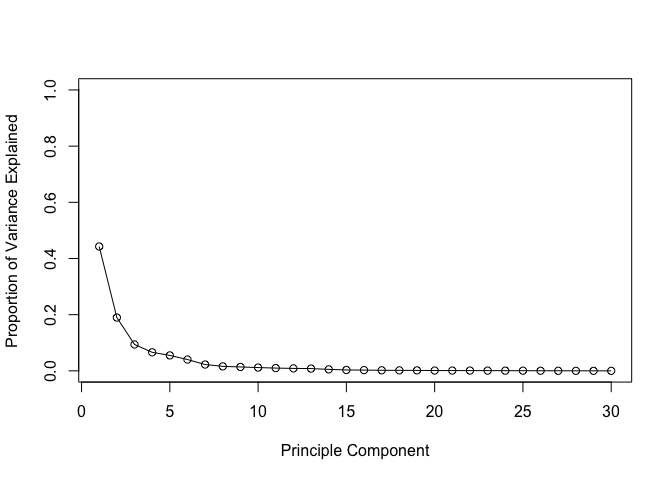
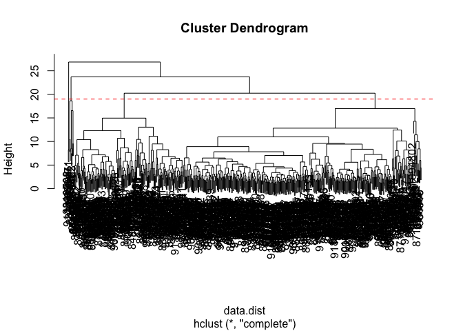
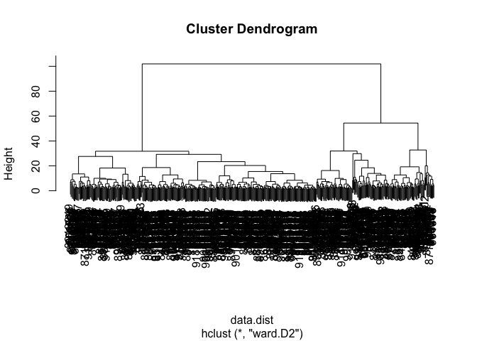
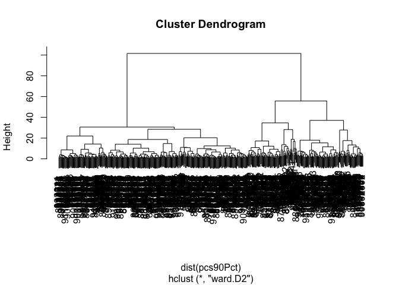

Class 08: Machine Learning Mini Project
================
Nicholas Yousefi

## Importing the Data:

``` r
fna.data <- "WisconsinCancer.csv"

wisc.df <- read.csv(fna.data, row.names=1)

head(wisc.df)
```

             diagnosis radius_mean texture_mean perimeter_mean area_mean
    842302           M       17.99        10.38         122.80    1001.0
    842517           M       20.57        17.77         132.90    1326.0
    84300903         M       19.69        21.25         130.00    1203.0
    84348301         M       11.42        20.38          77.58     386.1
    84358402         M       20.29        14.34         135.10    1297.0
    843786           M       12.45        15.70          82.57     477.1
             smoothness_mean compactness_mean concavity_mean concave.points_mean
    842302           0.11840          0.27760         0.3001             0.14710
    842517           0.08474          0.07864         0.0869             0.07017
    84300903         0.10960          0.15990         0.1974             0.12790
    84348301         0.14250          0.28390         0.2414             0.10520
    84358402         0.10030          0.13280         0.1980             0.10430
    843786           0.12780          0.17000         0.1578             0.08089
             symmetry_mean fractal_dimension_mean radius_se texture_se perimeter_se
    842302          0.2419                0.07871    1.0950     0.9053        8.589
    842517          0.1812                0.05667    0.5435     0.7339        3.398
    84300903        0.2069                0.05999    0.7456     0.7869        4.585
    84348301        0.2597                0.09744    0.4956     1.1560        3.445
    84358402        0.1809                0.05883    0.7572     0.7813        5.438
    843786          0.2087                0.07613    0.3345     0.8902        2.217
             area_se smoothness_se compactness_se concavity_se concave.points_se
    842302    153.40      0.006399        0.04904      0.05373           0.01587
    842517     74.08      0.005225        0.01308      0.01860           0.01340
    84300903   94.03      0.006150        0.04006      0.03832           0.02058
    84348301   27.23      0.009110        0.07458      0.05661           0.01867
    84358402   94.44      0.011490        0.02461      0.05688           0.01885
    843786     27.19      0.007510        0.03345      0.03672           0.01137
             symmetry_se fractal_dimension_se radius_worst texture_worst
    842302       0.03003             0.006193        25.38         17.33
    842517       0.01389             0.003532        24.99         23.41
    84300903     0.02250             0.004571        23.57         25.53
    84348301     0.05963             0.009208        14.91         26.50
    84358402     0.01756             0.005115        22.54         16.67
    843786       0.02165             0.005082        15.47         23.75
             perimeter_worst area_worst smoothness_worst compactness_worst
    842302            184.60     2019.0           0.1622            0.6656
    842517            158.80     1956.0           0.1238            0.1866
    84300903          152.50     1709.0           0.1444            0.4245
    84348301           98.87      567.7           0.2098            0.8663
    84358402          152.20     1575.0           0.1374            0.2050
    843786            103.40      741.6           0.1791            0.5249
             concavity_worst concave.points_worst symmetry_worst
    842302            0.7119               0.2654         0.4601
    842517            0.2416               0.1860         0.2750
    84300903          0.4504               0.2430         0.3613
    84348301          0.6869               0.2575         0.6638
    84358402          0.4000               0.1625         0.2364
    843786            0.5355               0.1741         0.3985
             fractal_dimension_worst
    842302                   0.11890
    842517                   0.08902
    84300903                 0.08758
    84348301                 0.17300
    84358402                 0.07678
    843786                   0.12440

The `diagnosis` column is our “answer” to the problem. To make sure we
do not use it by accident, we will delete this column.

``` r
wisc.data <- wisc.df[,-1]
head(wisc.data)
```

             radius_mean texture_mean perimeter_mean area_mean smoothness_mean
    842302         17.99        10.38         122.80    1001.0         0.11840
    842517         20.57        17.77         132.90    1326.0         0.08474
    84300903       19.69        21.25         130.00    1203.0         0.10960
    84348301       11.42        20.38          77.58     386.1         0.14250
    84358402       20.29        14.34         135.10    1297.0         0.10030
    843786         12.45        15.70          82.57     477.1         0.12780
             compactness_mean concavity_mean concave.points_mean symmetry_mean
    842302            0.27760         0.3001             0.14710        0.2419
    842517            0.07864         0.0869             0.07017        0.1812
    84300903          0.15990         0.1974             0.12790        0.2069
    84348301          0.28390         0.2414             0.10520        0.2597
    84358402          0.13280         0.1980             0.10430        0.1809
    843786            0.17000         0.1578             0.08089        0.2087
             fractal_dimension_mean radius_se texture_se perimeter_se area_se
    842302                  0.07871    1.0950     0.9053        8.589  153.40
    842517                  0.05667    0.5435     0.7339        3.398   74.08
    84300903                0.05999    0.7456     0.7869        4.585   94.03
    84348301                0.09744    0.4956     1.1560        3.445   27.23
    84358402                0.05883    0.7572     0.7813        5.438   94.44
    843786                  0.07613    0.3345     0.8902        2.217   27.19
             smoothness_se compactness_se concavity_se concave.points_se
    842302        0.006399        0.04904      0.05373           0.01587
    842517        0.005225        0.01308      0.01860           0.01340
    84300903      0.006150        0.04006      0.03832           0.02058
    84348301      0.009110        0.07458      0.05661           0.01867
    84358402      0.011490        0.02461      0.05688           0.01885
    843786        0.007510        0.03345      0.03672           0.01137
             symmetry_se fractal_dimension_se radius_worst texture_worst
    842302       0.03003             0.006193        25.38         17.33
    842517       0.01389             0.003532        24.99         23.41
    84300903     0.02250             0.004571        23.57         25.53
    84348301     0.05963             0.009208        14.91         26.50
    84358402     0.01756             0.005115        22.54         16.67
    843786       0.02165             0.005082        15.47         23.75
             perimeter_worst area_worst smoothness_worst compactness_worst
    842302            184.60     2019.0           0.1622            0.6656
    842517            158.80     1956.0           0.1238            0.1866
    84300903          152.50     1709.0           0.1444            0.4245
    84348301           98.87      567.7           0.2098            0.8663
    84358402          152.20     1575.0           0.1374            0.2050
    843786            103.40      741.6           0.1791            0.5249
             concavity_worst concave.points_worst symmetry_worst
    842302            0.7119               0.2654         0.4601
    842517            0.2416               0.1860         0.2750
    84300903          0.4504               0.2430         0.3613
    84348301          0.6869               0.2575         0.6638
    84358402          0.4000               0.1625         0.2364
    843786            0.5355               0.1741         0.3985
             fractal_dimension_worst
    842302                   0.11890
    842517                   0.08902
    84300903                 0.08758
    84348301                 0.17300
    84358402                 0.07678
    843786                   0.12440

We will store the `diagnosis` data in a separate vector to check our
work later.

``` r
diagnosis <- as.factor(wisc.df[,1])
```

## Exploring the Data

We will now explore the data to get a general idea of it.

> Q1. How many observations are in this dataset?

``` r
nrow(wisc.data)
```

    [1] 569

> Q2. How many of the observations have a malignant diagnosis?

``` r
table(wisc.df$diagnosis)
```


      B   M 
    357 212 

> Q3. How many variables/features in the data are suffixed with \_mean?

``` r
length(grep("_mean", colnames(wisc.data)))
```

    [1] 10

## Principal Component Analysis

Before we perform PCA, we must check if the data must be scaled. They
may need to be scaled if the input variables use different units of
measurement, or if the input variables have significantly different
variances.

Each column of the data is in different units. Therefore, some of the
numbers are in the hundreds and some are single digits. If you look at
the means of each column, they are pretty different. Same with the
standard deviation. The PCA will find the data to be most spread in the
variables with the most variance. Therefore, if we do not scale our
data, it will screw up our PCA.

When we set the `scale=T`, it will scale the data to account for these
issues.

``` r
colMeans(wisc.data)
```

                radius_mean            texture_mean          perimeter_mean 
               1.412729e+01            1.928965e+01            9.196903e+01 
                  area_mean         smoothness_mean        compactness_mean 
               6.548891e+02            9.636028e-02            1.043410e-01 
             concavity_mean     concave.points_mean           symmetry_mean 
               8.879932e-02            4.891915e-02            1.811619e-01 
     fractal_dimension_mean               radius_se              texture_se 
               6.279761e-02            4.051721e-01            1.216853e+00 
               perimeter_se                 area_se           smoothness_se 
               2.866059e+00            4.033708e+01            7.040979e-03 
             compactness_se            concavity_se       concave.points_se 
               2.547814e-02            3.189372e-02            1.179614e-02 
                symmetry_se    fractal_dimension_se            radius_worst 
               2.054230e-02            3.794904e-03            1.626919e+01 
              texture_worst         perimeter_worst              area_worst 
               2.567722e+01            1.072612e+02            8.805831e+02 
           smoothness_worst       compactness_worst         concavity_worst 
               1.323686e-01            2.542650e-01            2.721885e-01 
       concave.points_worst          symmetry_worst fractal_dimension_worst 
               1.146062e-01            2.900756e-01            8.394582e-02 

``` r
apply(wisc.data, 2, sd)
```

                radius_mean            texture_mean          perimeter_mean 
               3.524049e+00            4.301036e+00            2.429898e+01 
                  area_mean         smoothness_mean        compactness_mean 
               3.519141e+02            1.406413e-02            5.281276e-02 
             concavity_mean     concave.points_mean           symmetry_mean 
               7.971981e-02            3.880284e-02            2.741428e-02 
     fractal_dimension_mean               radius_se              texture_se 
               7.060363e-03            2.773127e-01            5.516484e-01 
               perimeter_se                 area_se           smoothness_se 
               2.021855e+00            4.549101e+01            3.002518e-03 
             compactness_se            concavity_se       concave.points_se 
               1.790818e-02            3.018606e-02            6.170285e-03 
                symmetry_se    fractal_dimension_se            radius_worst 
               8.266372e-03            2.646071e-03            4.833242e+00 
              texture_worst         perimeter_worst              area_worst 
               6.146258e+00            3.360254e+01            5.693570e+02 
           smoothness_worst       compactness_worst         concavity_worst 
               2.283243e-02            1.573365e-01            2.086243e-01 
       concave.points_worst          symmetry_worst fractal_dimension_worst 
               6.573234e-02            6.186747e-02            1.806127e-02 

Now, let’s run PCA. Some of these means and standard deviations are
pretty different, so we need to scale.

``` r
wisc.pr <- prcomp(wisc.data, scale=T)
y <- summary(wisc.pr)
y
```

    Importance of components:
                              PC1    PC2     PC3     PC4     PC5     PC6     PC7
    Standard deviation     3.6444 2.3857 1.67867 1.40735 1.28403 1.09880 0.82172
    Proportion of Variance 0.4427 0.1897 0.09393 0.06602 0.05496 0.04025 0.02251
    Cumulative Proportion  0.4427 0.6324 0.72636 0.79239 0.84734 0.88759 0.91010
                               PC8    PC9    PC10   PC11    PC12    PC13    PC14
    Standard deviation     0.69037 0.6457 0.59219 0.5421 0.51104 0.49128 0.39624
    Proportion of Variance 0.01589 0.0139 0.01169 0.0098 0.00871 0.00805 0.00523
    Cumulative Proportion  0.92598 0.9399 0.95157 0.9614 0.97007 0.97812 0.98335
                              PC15    PC16    PC17    PC18    PC19    PC20   PC21
    Standard deviation     0.30681 0.28260 0.24372 0.22939 0.22244 0.17652 0.1731
    Proportion of Variance 0.00314 0.00266 0.00198 0.00175 0.00165 0.00104 0.0010
    Cumulative Proportion  0.98649 0.98915 0.99113 0.99288 0.99453 0.99557 0.9966
                              PC22    PC23   PC24    PC25    PC26    PC27    PC28
    Standard deviation     0.16565 0.15602 0.1344 0.12442 0.09043 0.08307 0.03987
    Proportion of Variance 0.00091 0.00081 0.0006 0.00052 0.00027 0.00023 0.00005
    Cumulative Proportion  0.99749 0.99830 0.9989 0.99942 0.99969 0.99992 0.99997
                              PC29    PC30
    Standard deviation     0.02736 0.01153
    Proportion of Variance 0.00002 0.00000
    Cumulative Proportion  1.00000 1.00000

> Q4. From your results, what proportion of the original variance is
> captured by the first principal components (PC1)?

``` r
y$importance["Proportion of Variance","PC1"]
```

    [1] 0.44272

> Q5. How many principal components (PCs) are required to describe at
> least 70% of the original variance in the data?

``` r
sum(y$importance["Cumulative Proportion",] <= 0.7) + 1
```

    [1] 3

> Q6. How many principal components (PCs) are required to describe at
> least 90% of the original variance in the data?

``` r
sum(y$importance["Cumulative Proportion",] <= 0.9) + 1
```

    [1] 7

## Interpreting PCA Results

This is the output of calling the `plot()` function on our PCA object:

``` r
plot(wisc.pr)
```


Let’s try a new function, that we haven’t used before, to make the PC
plot.

``` r
biplot(wisc.pr)
```


> Q7. What stands out to you about this plot? Is it easy or difficult to
> understand? Why?

This plot is very messy and difficult to read. It is difficult to
understand since all the text overlaps and you can’t really read it.

Let’s make a better PC plot (aka “score plot” or “PC1 vs. PC2”, etc.
plot).

``` r
plot(wisc.pr$x[,1], wisc.pr$x[,2], col=diagnosis, xlab="PC1", ylab="PC2")
```


> Q8. Generate a similar plot for principal components 1 and 3. What do
> you notice about these plots?

``` r
plot(wisc.pr$x[,1], wisc.pr$x[,3], col=diagnosis, xlab="PC1", ylab="PC3")
```


I notice that in the plot of PC3 vs. PC1, there is a lot more overlap of
black and red dots, whereas in the plot of PC2 vs. PC1, there is a more
fine line between the black and the red dots. This is likely due to the
fact that PC3 captures less variance in the data than PC2.

Let’s make a nicer figure using `ggplot2`.

``` r
# first, we must convert the matrix, wisc.pr$x, into a data frame
df <- as.data.frame(wisc.pr$x)
df$diagnosis <- diagnosis # create a column called diagnosis

# load the ggplot2 package
library(ggplot2)

# create the graph
ggplot(df) + 
  aes(PC1, PC2, col=diagnosis) + 
  geom_point()
```


## Variance Explained

Let’s create a scree plot to show the proportion of variance explained
as we increase the number of principal components.

First, we must find the variance of each principle component. We do this
by squaring the standard deviation of each PC.

``` r
pr.var <- (wisc.pr$sdev)^2
head(pr.var)
```

    [1] 13.281608  5.691355  2.817949  1.980640  1.648731  1.207357

Lets calculate the proportion of variance explained by each principle
component. Then we will plot these proportions of variance for each
principle component.

``` r
# find proportion of variance explained by each PC
pve <- pr.var / sum(pr.var)

# create the plot
plot(pve, xlab="Principle Component", ylab="Proportion of Variance Explained", ylim=c(0, 1), type="o")
```



Alternatively, we could make a bar plot of the same data:

``` r
barplot(pve, ylab="Percent of Variance Explained", names.arg=paste0("PC", 1:length(pve)), las=2, axes=F)
axis(2, at=pve, labels=round(pve, 2)*100)
```


## Communicating PCA results

> Q9. For the first principal component, what is the component of the
> loading vector (i.e. wisc.pr\$rotation\[,1\]) for the feature
> concave.points_mean?

``` r
wisc.pr$rotation["concave.points_mean",1]
```

    [1] -0.2608538

> Q10. What is the minimum number of principal components required to
> explain 80% of the variance of the data?

``` r
sum(y$importance["Cumulative Proportion",] <= 0.8) + 1
```

    [1] 5

## Hierarchical Clustering

Let’s try doing Hierarchical Clustering on the original data.

First, we must scale the `wisc.data`:

``` r
data.scaled <- scale(wisc.data)
```

Next, we calculate the Euclidean distances between all pairs of
observations:

``` r
data.dist <- dist(data.scaled)
```

Finally, we perform the hierarchical clustering. We will use complete
linkage.

``` r
wisc.hclust <- hclust(data.dist, method="complete")
```

Now, let’s try to determine at what height there are 4 clusters:

> Q11. Using the plot() and abline() functions, what is the height at
> which the clustering model has 4 clusters?

``` r
plot(wisc.hclust)
abline(h=19, col="red", lty=2)
```



Let’s compare our hierarchical clustering model to the actual diagnosis.

First, we will cut the tree where there are 4 columns:

``` r
wisc.hclust.clusters <- cutree(wisc.hclust, k=4)
table(wisc.hclust.clusters, diagnosis)
```

                        diagnosis
    wisc.hclust.clusters   B   M
                       1  12 165
                       2   2   5
                       3 343  40
                       4   0   2

Looking at the comparison of clusters to diagnoses, cluster 1 seems to
have a lot of malignant cells and cluster 3 has a lot of benign cells.

> Q12 Can you find a better cluster vs diagnoses match by cutting into a
> different number of clusters between 2 and 10?

``` r
wisc.hclust.clusters.altk <- cutree(wisc.hclust, k=5)
table(wisc.hclust.clusters.altk, diagnosis)
```

                             diagnosis
    wisc.hclust.clusters.altk   B   M
                            1  12 165
                            2   0   5
                            3 343  40
                            4   2   0
                            5   0   2

I can’t find a cluster vs. diagnosis match that is significantly better
than 4. However, cutting into 5 clusters is slightly better because it
appears to make it more obvious that cluster 2 holds malignant tumors.
However, if more data points were added, I am sure clusters 2, 4, and 5
would become kind of ambiguous again. There is not much that can be done
about the false diagnoses in clusters 1 and 3, though. They seem to stay
about the same no matter how many clusters there are.

> Q13. Which method gives your favorite results for the same data.dist
> dataset? Explain your reasoning.

``` r
wisc.hclust.altmethod <- hclust(data.dist, method="ward.D2")
plot(wisc.hclust.altmethod)
```



Of the 3 methods, I the results given by `"ward.D2"` the best since the
tree generated by it has two branches coming from its root, and all the
other branches stem from either of those. These two groups may
correspond to whether a sample is benign or malignant.

## Combining Methods

Let’s run hierarchical clustering on the PCA results. We will use the
number of PCs needed to describe at least 90% of the variability in the
data.

``` r
# find number of PCs needed to describe at least 90% of the variability in the data
numPCs90Pct <- sum(y$importance["Cumulative Proportion",] <= 0.9) + 1
# put all these PCs that we need together in a data frame
pcs90Pct <- as.data.frame(wisc.pr$x[,1:numPCs90Pct])
# make the plot by running hclust()
wisc.pr.hclust <- hclust(dist(pcs90Pct), method="ward.D2")
plot(wisc.pr.hclust)
```



It looks like there are two big main clusters. Perhaps these clusters
are our malignant and benign groups. Let’s cut the tree into two groups:

``` r
grps <- cutree(wisc.pr.hclust, k=2)
table(grps)
```

    grps
      1   2 
    216 353 

Let’s see how accurate the clustering was at predicting cancerous and
non-cancerous patients.

``` r
table(grps, diagnosis)
```

        diagnosis
    grps   B   M
       1  28 188
       2 329  24

As can be seen, the majority of patients were diagnosed correctly. We
have miss classified 28 benign patients as needing extra follow-up. We
would like to minimize this number.

Let’s make plots of the patients in each group and the diagnoses given
by PCA and hierarchical clustering.

``` r
plot(wisc.pr$x[,1:2], col=grps)
```


``` r
plot(wisc.pr$x[,1:2], col=diagnosis)
```


Let’s run hierarchical clustering with the first 7 PCs and cut it into 2
clusters.

``` r
wisc.pr.hclust <- hclust(dist(wisc.pr$x[,1:7]), method="ward.D2")
wisc.pr.hclust.clusters <- cutree(wisc.pr.hclust, k=2)
table.pr.hclust <- table(wisc.pr.hclust.clusters, diagnosis)
table.pr.hclust
```

                           diagnosis
    wisc.pr.hclust.clusters   B   M
                          1  28 188
                          2 329  24

> Q15. How well does the newly created model with four clusters separate
> out the two diagnoses?

This model seems to be pretty good at clustering patients based on their
diagnosis. It has about the same number of false positives as false
negatives, but it correctly diagnoses most of the patients.

> Q16. How well do the k-means and hierarchical clustering models you
> created in previous sections (i.e. before PCA) do in terms of
> separating the diagnoses? Again, use the table() function to compare
> the output of each model (wisc.km\$cluster and wisc.hclust.clusters)
> with the vector containing the actual diagnoses.

``` r
wisc.km <- kmeans(scale(wisc.data), centers=2, nstart=20)
table.km <- table(wisc.km$cluster, diagnosis)
table.km
```

       diagnosis
          B   M
      1 343  37
      2  14 175

``` r
table.hclust <- table(wisc.hclust.clusters, diagnosis)
table.hclust
```

                        diagnosis
    wisc.hclust.clusters   B   M
                       1  12 165
                       2   2   5
                       3 343  40
                       4   0   2

K-means seems to classify a lot of patients as benign when they are in
fact malignant (37 in this dataset). So does hierarchical clustering (40
patients in this dataset). They correctly diagnose most of the patients,
but have a lot of false negatives.

## Sensitivity/Specificity

> Q17. Which of your analysis procedures resulted in a clustering model
> with the best specificity? How about sensitivity?

``` r
calc.sen <- function(tp, fn) {
  return(tp / (tp + fn))
}
calc.sp <- function(tn, fn) {
  return(tn / (tn + fn))
}
tp.pr.hclust <- table.pr.hclust[1, "M"]
tn.pr.hclust <- table.pr.hclust[2, "B"]
fp.pr.hclust <- table.pr.hclust[1, "B"]
fn.pr.hclust <- table.pr.hclust[2, "M"]
tp.km <- table.km[2, "M"]
tn.km <- table.km[1, "B"]
fp.km <- table.km[2, "B"]
fn.km <- table.km[1, "M"]
tp.hclust <- table.hclust[1, "M"]
tn.hclust <- table.hclust[3, "B"]
fp.hclust <- table.hclust[1, "B"]
fn.hclust <- table.hclust[3, "M"]

"Sensitivity"
```

    [1] "Sensitivity"

``` r
calc.sen(tp.pr.hclust, fn.pr.hclust)
```

    [1] 0.8867925

``` r
calc.sen(tp.km, fn.km)
```

    [1] 0.8254717

``` r
calc.sen(tp.hclust, fn.hclust)
```

    [1] 0.804878

``` r
"Specificity"
```

    [1] "Specificity"

``` r
calc.sp(tn.pr.hclust, fn.pr.hclust)
```

    [1] 0.9320113

``` r
calc.sp(tn.km, fn.km)
```

    [1] 0.9026316

``` r
calc.sp(tn.hclust, fn.hclust)
```

    [1] 0.8955614

Doing PCA and Hierarchical Clustering has both the best specificity and
sensitivity.
