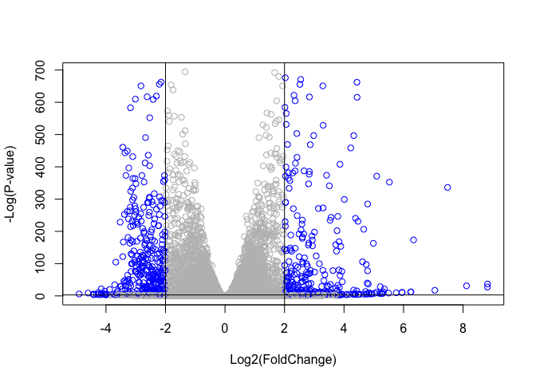

Class 13: RNASeq Mini Project
================
Nicholas Yousefi

The data for for hands-on session comes from GEO entry: GSE37704, which
is associated with the following publication:

> Trapnell C, Hendrickson DG, Sauvageau M, Goff L et al. “Differential
> analysis of gene regulation at transcript resolution with RNA-seq”.
> Nat Biotechnol 2013 Jan;31(1):46-53. PMID: 23222703

The authors report on differential analysis of lung fibroblasts in
response to loss of the developmental transcription factor HOXA1. Their
results and others indicate that HOXA1 is required for lung fibroblast
and HeLa cell cycle progression. In particular their analysis show that
“loss of HOXA1 results in significant expression level changes in
thousands of individual transcripts, along with isoform switching events
in key regulators of the cell cycle”. For our session we have used their
Sailfish gene-level estimated counts and hence are restricted to
protein-coding genes only.

# RNA Seq Input Data

Again, I need two things:

-   countData
-   colData

``` r
colData <- read.csv("GSE37704_metadata.csv", row.names=1)
head(colData)
```

                  condition
    SRR493366 control_sirna
    SRR493367 control_sirna
    SRR493368 control_sirna
    SRR493369      hoxa1_kd
    SRR493370      hoxa1_kd
    SRR493371      hoxa1_kd

``` r
countData <- read.csv("GSE37704_featurecounts.csv", row.names=1)
head(countData)
```

                    length SRR493366 SRR493367 SRR493368 SRR493369 SRR493370
    ENSG00000186092    918         0         0         0         0         0
    ENSG00000279928    718         0         0         0         0         0
    ENSG00000279457   1982        23        28        29        29        28
    ENSG00000278566    939         0         0         0         0         0
    ENSG00000273547    939         0         0         0         0         0
    ENSG00000187634   3214       124       123       205       207       212
                    SRR493371
    ENSG00000186092         0
    ENSG00000279928         0
    ENSG00000279457        46
    ENSG00000278566         0
    ENSG00000273547         0
    ENSG00000187634       258

There is an unwanted first column “length” in the countData. I will need
to remove this first before going on to further analysis.

> Q. Complete the code below to remove the troublesome first column from
> `countData`

``` r
counts <- countData[, -1]
head(counts)
```

                    SRR493366 SRR493367 SRR493368 SRR493369 SRR493370 SRR493371
    ENSG00000186092         0         0         0         0         0         0
    ENSG00000279928         0         0         0         0         0         0
    ENSG00000279457        23        28        29        29        28        46
    ENSG00000278566         0         0         0         0         0         0
    ENSG00000273547         0         0         0         0         0         0
    ENSG00000187634       124       123       205       207       212       258

Check that the column names in `counts` match the row names in
`colData`.

``` r
all(colnames(counts) == rownames(colData))
```

    [1] TRUE

# Remove zero count genes

``` r
head(counts)
```

                    SRR493366 SRR493367 SRR493368 SRR493369 SRR493370 SRR493371
    ENSG00000186092         0         0         0         0         0         0
    ENSG00000279928         0         0         0         0         0         0
    ENSG00000279457        23        28        29        29        28        46
    ENSG00000278566         0         0         0         0         0         0
    ENSG00000273547         0         0         0         0         0         0
    ENSG00000187634       124       123       205       207       212       258

There are lots of genes here with no count data - i.e. zero counts in
all experiments. Let’s remove these before running DESeq.

> Q. Complete the code below to filter countData to exclude genes
> (i.e. rows) where we have 0 read count across all samples
> (i.e. columns).

> Tip: What will rowSums() of countData return and how could you use it
> in this context?

``` r
# Filter count data where you have 0 read count across all samples.
counts = counts[rowSums(counts) != 0, ]
head(counts)
```

                    SRR493366 SRR493367 SRR493368 SRR493369 SRR493370 SRR493371
    ENSG00000279457        23        28        29        29        28        46
    ENSG00000187634       124       123       205       207       212       258
    ENSG00000188976      1637      1831      2383      1226      1326      1504
    ENSG00000187961       120       153       180       236       255       357
    ENSG00000187583        24        48        65        44        48        64
    ENSG00000187642         4         9        16        14        16        16

How many genes do we have left?

``` r
nrow(counts) # should be 15975
```

    [1] 15975

# Time to use DESeq

``` r
library(DESeq2)
```

    Loading required package: S4Vectors

    Loading required package: stats4

    Loading required package: BiocGenerics


    Attaching package: 'BiocGenerics'

    The following objects are masked from 'package:stats':

        IQR, mad, sd, var, xtabs

    The following objects are masked from 'package:base':

        anyDuplicated, append, as.data.frame, basename, cbind, colnames,
        dirname, do.call, duplicated, eval, evalq, Filter, Find, get, grep,
        grepl, intersect, is.unsorted, lapply, Map, mapply, match, mget,
        order, paste, pmax, pmax.int, pmin, pmin.int, Position, rank,
        rbind, Reduce, rownames, sapply, setdiff, sort, table, tapply,
        union, unique, unsplit, which.max, which.min


    Attaching package: 'S4Vectors'

    The following objects are masked from 'package:base':

        expand.grid, I, unname

    Loading required package: IRanges

    Loading required package: GenomicRanges

    Loading required package: GenomeInfoDb

    Loading required package: SummarizedExperiment

    Loading required package: MatrixGenerics

    Loading required package: matrixStats


    Attaching package: 'MatrixGenerics'

    The following objects are masked from 'package:matrixStats':

        colAlls, colAnyNAs, colAnys, colAvgsPerRowSet, colCollapse,
        colCounts, colCummaxs, colCummins, colCumprods, colCumsums,
        colDiffs, colIQRDiffs, colIQRs, colLogSumExps, colMadDiffs,
        colMads, colMaxs, colMeans2, colMedians, colMins, colOrderStats,
        colProds, colQuantiles, colRanges, colRanks, colSdDiffs, colSds,
        colSums2, colTabulates, colVarDiffs, colVars, colWeightedMads,
        colWeightedMeans, colWeightedMedians, colWeightedSds,
        colWeightedVars, rowAlls, rowAnyNAs, rowAnys, rowAvgsPerColSet,
        rowCollapse, rowCounts, rowCummaxs, rowCummins, rowCumprods,
        rowCumsums, rowDiffs, rowIQRDiffs, rowIQRs, rowLogSumExps,
        rowMadDiffs, rowMads, rowMaxs, rowMeans2, rowMedians, rowMins,
        rowOrderStats, rowProds, rowQuantiles, rowRanges, rowRanks,
        rowSdDiffs, rowSds, rowSums2, rowTabulates, rowVarDiffs, rowVars,
        rowWeightedMads, rowWeightedMeans, rowWeightedMedians,
        rowWeightedSds, rowWeightedVars

    Loading required package: Biobase

    Welcome to Bioconductor

        Vignettes contain introductory material; view with
        'browseVignettes()'. To cite Bioconductor, see
        'citation("Biobase")', and for packages 'citation("pkgname")'.


    Attaching package: 'Biobase'

    The following object is masked from 'package:MatrixGenerics':

        rowMedians

    The following objects are masked from 'package:matrixStats':

        anyMissing, rowMedians

1st step: Setup the object required by DESeq

``` r
dds <- DESeqDataSetFromMatrix(countData=counts, 
                       colData=colData,
                       design=~condition)
```

    Warning in DESeqDataSet(se, design = design, ignoreRank): some variables in
    design formula are characters, converting to factors

Run the Analysis

``` r
dds <- DESeq(dds)
```

    estimating size factors

    estimating dispersions

    gene-wise dispersion estimates

    mean-dispersion relationship

    final dispersion estimates

    fitting model and testing

``` r
dds
```

    class: DESeqDataSet 
    dim: 15975 6 
    metadata(1): version
    assays(4): counts mu H cooks
    rownames(15975): ENSG00000279457 ENSG00000187634 ... ENSG00000276345
      ENSG00000271254
    rowData names(22): baseMean baseVar ... deviance maxCooks
    colnames(6): SRR493366 SRR493367 ... SRR493370 SRR493371
    colData names(2): condition sizeFactor

``` r
res <- results(dds, contrast=c("condition", "hoxa1_kd", "control_sirna"))
head(res)
```

    log2 fold change (MLE): condition hoxa1_kd vs control_sirna 
    Wald test p-value: condition hoxa1 kd vs control sirna 
    DataFrame with 6 rows and 6 columns
                     baseMean log2FoldChange     lfcSE       stat      pvalue
                    <numeric>      <numeric> <numeric>  <numeric>   <numeric>
    ENSG00000279457   29.9136      0.1792571 0.3248216   0.551863 5.81042e-01
    ENSG00000187634  183.2296      0.4264571 0.1402658   3.040350 2.36304e-03
    ENSG00000188976 1651.1881     -0.6927205 0.0548465 -12.630158 1.43990e-36
    ENSG00000187961  209.6379      0.7297556 0.1318599   5.534326 3.12428e-08
    ENSG00000187583   47.2551      0.0405765 0.2718928   0.149237 8.81366e-01
    ENSG00000187642   11.9798      0.5428105 0.5215598   1.040744 2.97994e-01
                           padj
                      <numeric>
    ENSG00000279457 6.86555e-01
    ENSG00000187634 5.15718e-03
    ENSG00000188976 1.76549e-35
    ENSG00000187961 1.13413e-07
    ENSG00000187583 9.19031e-01
    ENSG00000187642 4.03379e-01

> Q. Call the summary() function on your results to get a sense of how
> many genes are up or down-regulated at the default 0.1 p-value cutoff.

``` r
summary(res)
```


    out of 15975 with nonzero total read count
    adjusted p-value < 0.1
    LFC > 0 (up)       : 4349, 27%
    LFC < 0 (down)     : 4396, 28%
    outliers [1]       : 0, 0%
    low counts [2]     : 1237, 7.7%
    (mean count < 0)
    [1] see 'cooksCutoff' argument of ?results
    [2] see 'independentFiltering' argument of ?results

# Volcano Plot

``` r
plot(res$log2FoldChange, -log(res$padj))
```


> Q. Improve this plot by completing the below code, which adds color
> and axis labels

``` r
mycols <- rep("gray", nrow(res))
mycols[abs(res$log2FoldChange) > 2] <- "gray"
inds <- (res$padj < 0.05) & (abs(res$log2FoldChange) > 2)
mycols[inds] <- "blue"

plot( res$log2FoldChange, -log(res$padj), col=mycols, xlab="Log2(FoldChange)", ylab="-Log(P-value)" )
abline(v=c(-2, 2))
abline(h=-log(0.05))
```



# Adding Gene Annotation

I am going to add the database identifiers I need for pathway analysis
here.

``` r
library("AnnotationDbi")
library("org.Hs.eg.db")
```

``` r
columns(org.Hs.eg.db)
```

     [1] "ACCNUM"       "ALIAS"        "ENSEMBL"      "ENSEMBLPROT"  "ENSEMBLTRANS"
     [6] "ENTREZID"     "ENZYME"       "EVIDENCE"     "EVIDENCEALL"  "GENENAME"    
    [11] "GENETYPE"     "GO"           "GOALL"        "IPI"          "MAP"         
    [16] "OMIM"         "ONTOLOGY"     "ONTOLOGYALL"  "PATH"         "PFAM"        
    [21] "PMID"         "PROSITE"      "REFSEQ"       "SYMBOL"       "UCSCKG"      
    [26] "UNIPROT"     

> Q. Use the mapIDs() function multiple times to add SYMBOL, ENTREZID
> and GENENAME annotation to our results by completing the code below.

``` r
res$symbol = mapIds(org.Hs.eg.db,
                    keys=row.names(res), 
                    keytype="ENSEMBL",
                    column="SYMBOL",
                    multiVals="first")
```

    'select()' returned 1:many mapping between keys and columns

``` r
res$entrez = mapIds(org.Hs.eg.db,
                    keys=row.names(res),
                    keytype="ENSEMBL",
                    column="ENTREZID",
                    multiVals="first")
```

    'select()' returned 1:many mapping between keys and columns

``` r
res$name =   mapIds(org.Hs.eg.db,
                    keys=row.names(res),
                    keytype="ENSEMBL",
                    column="GENENAME",
                    multiVals="first")
```

    'select()' returned 1:many mapping between keys and columns

``` r
head(res)
```

    log2 fold change (MLE): condition hoxa1_kd vs control_sirna 
    Wald test p-value: condition hoxa1 kd vs control sirna 
    DataFrame with 6 rows and 9 columns
                     baseMean log2FoldChange     lfcSE       stat      pvalue
                    <numeric>      <numeric> <numeric>  <numeric>   <numeric>
    ENSG00000279457   29.9136      0.1792571 0.3248216   0.551863 5.81042e-01
    ENSG00000187634  183.2296      0.4264571 0.1402658   3.040350 2.36304e-03
    ENSG00000188976 1651.1881     -0.6927205 0.0548465 -12.630158 1.43990e-36
    ENSG00000187961  209.6379      0.7297556 0.1318599   5.534326 3.12428e-08
    ENSG00000187583   47.2551      0.0405765 0.2718928   0.149237 8.81366e-01
    ENSG00000187642   11.9798      0.5428105 0.5215598   1.040744 2.97994e-01
                           padj      symbol      entrez                   name
                      <numeric> <character> <character>            <character>
    ENSG00000279457 6.86555e-01          NA          NA                     NA
    ENSG00000187634 5.15718e-03      SAMD11      148398 sterile alpha motif ..
    ENSG00000188976 1.76549e-35       NOC2L       26155 NOC2 like nucleolar ..
    ENSG00000187961 1.13413e-07      KLHL17      339451 kelch like family me..
    ENSG00000187583 9.19031e-01     PLEKHN1       84069 pleckstrin homology ..
    ENSG00000187642 4.03379e-01       PERM1       84808 PPARGC1 and ESRR ind..

Save my results so far to a CSV file.

> Q. Finally for this section let’s reorder these results by adjusted
> p-value and save them to a CSV file in your current project directory.

``` r
res = res[order(res$pvalue),]
write.csv(res, file="deseq_results.csv")
```

# Pathway Analysis

Again, we will use the `gage()` package and function with a focus first
on KEGG and GO.

``` r
library(gage)
```

``` r
library(gageData)

data(kegg.sets.hs)
data(sigmet.idx.hs)

# Focus on signaling and metabolic pathways only
kegg.sets.hs = kegg.sets.hs[sigmet.idx.hs]

# Examine the first 3 pathways
head(kegg.sets.hs, 3)
```

    $`hsa00232 Caffeine metabolism`
    [1] "10"   "1544" "1548" "1549" "1553" "7498" "9"   

    $`hsa00983 Drug metabolism - other enzymes`
     [1] "10"     "1066"   "10720"  "10941"  "151531" "1548"   "1549"   "1551"  
     [9] "1553"   "1576"   "1577"   "1806"   "1807"   "1890"   "221223" "2990"  
    [17] "3251"   "3614"   "3615"   "3704"   "51733"  "54490"  "54575"  "54576" 
    [25] "54577"  "54578"  "54579"  "54600"  "54657"  "54658"  "54659"  "54963" 
    [33] "574537" "64816"  "7083"   "7084"   "7172"   "7363"   "7364"   "7365"  
    [41] "7366"   "7367"   "7371"   "7372"   "7378"   "7498"   "79799"  "83549" 
    [49] "8824"   "8833"   "9"      "978"   

    $`hsa00230 Purine metabolism`
      [1] "100"    "10201"  "10606"  "10621"  "10622"  "10623"  "107"    "10714" 
      [9] "108"    "10846"  "109"    "111"    "11128"  "11164"  "112"    "113"   
     [17] "114"    "115"    "122481" "122622" "124583" "132"    "158"    "159"   
     [25] "1633"   "171568" "1716"   "196883" "203"    "204"    "205"    "221823"
     [33] "2272"   "22978"  "23649"  "246721" "25885"  "2618"   "26289"  "270"   
     [41] "271"    "27115"  "272"    "2766"   "2977"   "2982"   "2983"   "2984"  
     [49] "2986"   "2987"   "29922"  "3000"   "30833"  "30834"  "318"    "3251"  
     [57] "353"    "3614"   "3615"   "3704"   "377841" "471"    "4830"   "4831"  
     [65] "4832"   "4833"   "4860"   "4881"   "4882"   "4907"   "50484"  "50940" 
     [73] "51082"  "51251"  "51292"  "5136"   "5137"   "5138"   "5139"   "5140"  
     [81] "5141"   "5142"   "5143"   "5144"   "5145"   "5146"   "5147"   "5148"  
     [89] "5149"   "5150"   "5151"   "5152"   "5153"   "5158"   "5167"   "5169"  
     [97] "51728"  "5198"   "5236"   "5313"   "5315"   "53343"  "54107"  "5422"  
    [105] "5424"   "5425"   "5426"   "5427"   "5430"   "5431"   "5432"   "5433"  
    [113] "5434"   "5435"   "5436"   "5437"   "5438"   "5439"   "5440"   "5441"  
    [121] "5471"   "548644" "55276"  "5557"   "5558"   "55703"  "55811"  "55821" 
    [129] "5631"   "5634"   "56655"  "56953"  "56985"  "57804"  "58497"  "6240"  
    [137] "6241"   "64425"  "646625" "654364" "661"    "7498"   "8382"   "84172" 
    [145] "84265"  "84284"  "84618"  "8622"   "8654"   "87178"  "8833"   "9060"  
    [153] "9061"   "93034"  "953"    "9533"   "954"    "955"    "956"    "957"   
    [161] "9583"   "9615"  

Recall that `gage()` wants only a vector of importance as input that has
names in ENTREZ ID format.

``` r
foldchanges = res$log2FoldChange
names(foldchanges) = res$entrez
head(foldchanges)
```

         1266     54855      1465     51232      2034      2317 
    -2.422719  3.201955 -2.313738 -2.059631 -1.888019 -1.649792 

``` r
# Get the results
keggres = gage(foldchanges, gsets=kegg.sets.hs)
```

``` r
head(keggres$less, 5)
```

                                         p.geomean stat.mean        p.val
    hsa04110 Cell cycle               8.995727e-06 -4.378644 8.995727e-06
    hsa03030 DNA replication          9.424076e-05 -3.951803 9.424076e-05
    hsa03013 RNA transport            1.375901e-03 -3.028500 1.375901e-03
    hsa03440 Homologous recombination 3.066756e-03 -2.852899 3.066756e-03
    hsa04114 Oocyte meiosis           3.784520e-03 -2.698128 3.784520e-03
                                            q.val set.size         exp1
    hsa04110 Cell cycle               0.001448312      121 8.995727e-06
    hsa03030 DNA replication          0.007586381       36 9.424076e-05
    hsa03013 RNA transport            0.073840037      144 1.375901e-03
    hsa03440 Homologous recombination 0.121861535       28 3.066756e-03
    hsa04114 Oocyte meiosis           0.121861535      102 3.784520e-03

Generate a colored pathway figure for hsa04110 Cell cycle.

``` r
library(pathview)
```

    ##############################################################################
    Pathview is an open source software package distributed under GNU General
    Public License version 3 (GPLv3). Details of GPLv3 is available at
    http://www.gnu.org/licenses/gpl-3.0.html. Particullary, users are required to
    formally cite the original Pathview paper (not just mention it) in publications
    or products. For details, do citation("pathview") within R.

    The pathview downloads and uses KEGG data. Non-academic uses may require a KEGG
    license agreement (details at http://www.kegg.jp/kegg/legal.html).
    ##############################################################################

``` r
pathview(gene.data=foldchanges, pathway.id="hsa04110")
```

    'select()' returned 1:1 mapping between keys and columns

    Info: Working in directory /Users/nicholasyousefi/Library/CloudStorage/GoogleDrive-nsyousef@ucsd.edu/My Drive/Classes/Y4Q1/BIMM 143/Labs/bimm143/BIMM143_github/class13

    Info: Writing image file hsa04110.pathview.png


We can also make a PDF of our results:

``` r
pathview(gene.data=foldchanges, pathway.id="hsa04110", kegg.native=FALSE)
```

    'select()' returned 1:1 mapping between keys and columns

    Info: Working in directory /Users/nicholasyousefi/Library/CloudStorage/GoogleDrive-nsyousef@ucsd.edu/My Drive/Classes/Y4Q1/BIMM 143/Labs/bimm143/BIMM143_github/class13

    Info: Writing image file hsa04110.pathview.pdf

Let’s just focus on the top 5 upregulated pathways. We need to extract
the 8 character long ID from the rowname strings.

``` r
keggrespathways <- rownames(keggres$greater)[1:5]
keggresids = substr(keggrespathways, start=1, stop=8)
keggresids
```

    [1] "hsa04640" "hsa04630" "hsa00140" "hsa04142" "hsa04330"

Now, let’s use the `pathview()` function to draw plots for all of these
pathways.

``` r
pathview(gene.data=foldchanges, pathway.id=keggresids, species="hsa")
```

    'select()' returned 1:1 mapping between keys and columns

    Info: Working in directory /Users/nicholasyousefi/Library/CloudStorage/GoogleDrive-nsyousef@ucsd.edu/My Drive/Classes/Y4Q1/BIMM 143/Labs/bimm143/BIMM143_github/class13

    Info: Writing image file hsa04640.pathview.png

    'select()' returned 1:1 mapping between keys and columns

    Info: Working in directory /Users/nicholasyousefi/Library/CloudStorage/GoogleDrive-nsyousef@ucsd.edu/My Drive/Classes/Y4Q1/BIMM 143/Labs/bimm143/BIMM143_github/class13

    Info: Writing image file hsa04630.pathview.png

    'select()' returned 1:1 mapping between keys and columns

    Info: Working in directory /Users/nicholasyousefi/Library/CloudStorage/GoogleDrive-nsyousef@ucsd.edu/My Drive/Classes/Y4Q1/BIMM 143/Labs/bimm143/BIMM143_github/class13

    Info: Writing image file hsa00140.pathview.png

    'select()' returned 1:1 mapping between keys and columns

    Info: Working in directory /Users/nicholasyousefi/Library/CloudStorage/GoogleDrive-nsyousef@ucsd.edu/My Drive/Classes/Y4Q1/BIMM 143/Labs/bimm143/BIMM143_github/class13

    Info: Writing image file hsa04142.pathview.png

    Info: some node width is different from others, and hence adjusted!

    'select()' returned 1:1 mapping between keys and columns

    Info: Working in directory /Users/nicholasyousefi/Library/CloudStorage/GoogleDrive-nsyousef@ucsd.edu/My Drive/Classes/Y4Q1/BIMM 143/Labs/bimm143/BIMM143_github/class13

    Info: Writing image file hsa04330.pathview.png

Here are the figures it generated:


> Q. Can you do the same procedure as above to plot the pathview figures
> for the top 5 down-reguled pathways?

``` r
keggrespathwaysdownreg <- rownames(keggres$less)[1:5]
keggresidsdownreg = substr(keggrespathwaysdownreg, start=1, stop=8)
keggresidsdownreg
```

    [1] "hsa04110" "hsa03030" "hsa03013" "hsa03440" "hsa04114"

``` r
pathview(gene.data=foldchanges, pathway.id=keggresidsdownreg, species="hsa")
```

    'select()' returned 1:1 mapping between keys and columns

    Info: Working in directory /Users/nicholasyousefi/Library/CloudStorage/GoogleDrive-nsyousef@ucsd.edu/My Drive/Classes/Y4Q1/BIMM 143/Labs/bimm143/BIMM143_github/class13

    Info: Writing image file hsa04110.pathview.png

    'select()' returned 1:1 mapping between keys and columns

    Info: Working in directory /Users/nicholasyousefi/Library/CloudStorage/GoogleDrive-nsyousef@ucsd.edu/My Drive/Classes/Y4Q1/BIMM 143/Labs/bimm143/BIMM143_github/class13

    Info: Writing image file hsa03030.pathview.png

    'select()' returned 1:1 mapping between keys and columns

    Info: Working in directory /Users/nicholasyousefi/Library/CloudStorage/GoogleDrive-nsyousef@ucsd.edu/My Drive/Classes/Y4Q1/BIMM 143/Labs/bimm143/BIMM143_github/class13

    Info: Writing image file hsa03013.pathview.png

    'select()' returned 1:1 mapping between keys and columns

    Info: Working in directory /Users/nicholasyousefi/Library/CloudStorage/GoogleDrive-nsyousef@ucsd.edu/My Drive/Classes/Y4Q1/BIMM 143/Labs/bimm143/BIMM143_github/class13

    Info: Writing image file hsa03440.pathview.png

    'select()' returned 1:1 mapping between keys and columns

    Info: Working in directory /Users/nicholasyousefi/Library/CloudStorage/GoogleDrive-nsyousef@ucsd.edu/My Drive/Classes/Y4Q1/BIMM 143/Labs/bimm143/BIMM143_github/class13

    Info: Writing image file hsa04114.pathview.png


# Gene Ontology (GO)

We can do similar analysis using the Gene Ontology database.
`go.sets.hs` has all GO terms. `go.subs.hs` has indexes for the BP, CC,
and MF ontologies. We will focus on BP.

``` r
data(go.sets.hs)
data(go.subs.hs)

# Focus on Biological Process subset of GO
gobpsets = go.sets.hs[go.subs.hs$BP]

gobpres = gage(foldchanges, gsets=gobpsets, same.dir=TRUE)

lapply(gobpres, head)
```

    $greater
                                                 p.geomean stat.mean        p.val
    GO:0007156 homophilic cell adhesion       8.519724e-05  3.824205 8.519724e-05
    GO:0002009 morphogenesis of an epithelium 1.396681e-04  3.653886 1.396681e-04
    GO:0048729 tissue morphogenesis           1.432451e-04  3.643242 1.432451e-04
    GO:0007610 behavior                       2.195494e-04  3.530241 2.195494e-04
    GO:0060562 epithelial tube morphogenesis  5.932837e-04  3.261376 5.932837e-04
    GO:0035295 tube development               5.953254e-04  3.253665 5.953254e-04
                                                  q.val set.size         exp1
    GO:0007156 homophilic cell adhesion       0.1951953      113 8.519724e-05
    GO:0002009 morphogenesis of an epithelium 0.1951953      339 1.396681e-04
    GO:0048729 tissue morphogenesis           0.1951953      424 1.432451e-04
    GO:0007610 behavior                       0.2243795      427 2.195494e-04
    GO:0060562 epithelial tube morphogenesis  0.3711390      257 5.932837e-04
    GO:0035295 tube development               0.3711390      391 5.953254e-04

    $less
                                                p.geomean stat.mean        p.val
    GO:0048285 organelle fission             1.536227e-15 -8.063910 1.536227e-15
    GO:0000280 nuclear division              4.286961e-15 -7.939217 4.286961e-15
    GO:0007067 mitosis                       4.286961e-15 -7.939217 4.286961e-15
    GO:0000087 M phase of mitotic cell cycle 1.169934e-14 -7.797496 1.169934e-14
    GO:0007059 chromosome segregation        2.028624e-11 -6.878340 2.028624e-11
    GO:0000236 mitotic prometaphase          1.729553e-10 -6.695966 1.729553e-10
                                                    q.val set.size         exp1
    GO:0048285 organelle fission             5.841698e-12      376 1.536227e-15
    GO:0000280 nuclear division              5.841698e-12      352 4.286961e-15
    GO:0007067 mitosis                       5.841698e-12      352 4.286961e-15
    GO:0000087 M phase of mitotic cell cycle 1.195672e-11      362 1.169934e-14
    GO:0007059 chromosome segregation        1.658603e-08      142 2.028624e-11
    GO:0000236 mitotic prometaphase          1.178402e-07       84 1.729553e-10

    $stats
                                              stat.mean     exp1
    GO:0007156 homophilic cell adhesion        3.824205 3.824205
    GO:0002009 morphogenesis of an epithelium  3.653886 3.653886
    GO:0048729 tissue morphogenesis            3.643242 3.643242
    GO:0007610 behavior                        3.530241 3.530241
    GO:0060562 epithelial tube morphogenesis   3.261376 3.261376
    GO:0035295 tube development                3.253665 3.253665

# Reactome Analysis

Reactome is a database that contains biological molecules and their
relations to pathways and processes. We will analyze our list of
differentially expressed genes using reactome.

First, let’s save the genes that are signiifcantly expressed (i.e. p \<
0.05) as a text file.

``` r
sig_genes <- res[res$padj <= 0.05 & !is.na(res$padj), "symbol"]
print(paste("Total number of significant genes:", length(sig_genes)))
```

    [1] "Total number of significant genes: 8147"

``` r
write.table(sig_genes, file="significant_genes.txt", row.names=F, col.names=F, quote=F)
```

We can upload this file to the reactome website
(<https://reactome.org/PathwayBrowser/#TOOL=AT>) to perform pathway
analysis.

> Q: What pathway has the most significant “Entities p-value”? Do the
> most significant pathways listed match your previous KEGG results?
> What factors could cause differences between the two methods?

The pathway that has the most significant “Entities p-value” is the
Endosomal/Vacuolar pathway. Most of the most significant pathways listed
do not match my previous KEGG results. I think this is because for the
reactome analysis, we filtered the differentially expressed genes only
based on whether or not their padj was less than 0.05, not based on
their fold changes. In fact, we never inputted the fold changes into the
reactome analysis, so it could not take fold change into account at all.
However, with the KEGG analysis, we did not filter by padj. The
different methods of filtering significant data may have affected what
results were considered significant.

``` r
head(keggres$greater, 15)
```

                                                   p.geomean stat.mean       p.val
    hsa04640 Hematopoietic cell lineage          0.002822776  2.833362 0.002822776
    hsa04630 Jak-STAT signaling pathway          0.005202070  2.585673 0.005202070
    hsa00140 Steroid hormone biosynthesis        0.007255099  2.526744 0.007255099
    hsa04142 Lysosome                            0.010107392  2.338364 0.010107392
    hsa04330 Notch signaling pathway             0.018747253  2.111725 0.018747253
    hsa04916 Melanogenesis                       0.019399766  2.081927 0.019399766
    hsa04976 Bile secretion                      0.019732994  2.087255 0.019732994
    hsa04740 Olfactory transduction              0.021822268  2.048737 0.021822268
    hsa04010 MAPK signaling pathway              0.029980689  1.885463 0.029980689
    hsa04662 B cell receptor signaling pathway   0.034024302  1.840650 0.034024302
    hsa00511 Other glycan degradation            0.036345172  1.872479 0.036345172
    hsa00531 Glycosaminoglycan degradation       0.038015497  1.848386 0.038015497
    hsa04062 Chemokine signaling pathway         0.040644274  1.749571 0.040644274
    hsa02010 ABC transporters                    0.048339417  1.682076 0.048339417
    hsa04621 NOD-like receptor signaling pathway 0.061596657  1.554602 0.061596657
                                                     q.val set.size        exp1
    hsa04640 Hematopoietic cell lineage          0.3893570       55 0.002822776
    hsa04630 Jak-STAT signaling pathway          0.3893570      109 0.005202070
    hsa00140 Steroid hormone biosynthesis        0.3893570       31 0.007255099
    hsa04142 Lysosome                            0.4068225      118 0.010107392
    hsa04330 Notch signaling pathway             0.4391731       46 0.018747253
    hsa04916 Melanogenesis                       0.4391731       90 0.019399766
    hsa04976 Bile secretion                      0.4391731       50 0.019732994
    hsa04740 Olfactory transduction              0.4391731       52 0.021822268
    hsa04010 MAPK signaling pathway              0.5033637      245 0.029980689
    hsa04662 B cell receptor signaling pathway   0.5033637       66 0.034024302
    hsa00511 Other glycan degradation            0.5033637       16 0.036345172
    hsa00531 Glycosaminoglycan degradation       0.5033637       17 0.038015497
    hsa04062 Chemokine signaling pathway         0.5033637      146 0.040644274
    hsa02010 ABC transporters                    0.5539171       39 0.048339417
    hsa04621 NOD-like receptor signaling pathway 0.5539171       55 0.061596657

``` r
print("--------")
```

    [1] "--------"

``` r
head(keggres$less, 15)
```

                                                           p.geomean stat.mean
    hsa04110 Cell cycle                                 8.995727e-06 -4.378644
    hsa03030 DNA replication                            9.424076e-05 -3.951803
    hsa03013 RNA transport                              1.375901e-03 -3.028500
    hsa03440 Homologous recombination                   3.066756e-03 -2.852899
    hsa04114 Oocyte meiosis                             3.784520e-03 -2.698128
    hsa00010 Glycolysis / Gluconeogenesis               8.961413e-03 -2.405398
    hsa00240 Pyrimidine metabolism                      9.471025e-03 -2.367075
    hsa00670 One carbon pool by folate                  1.054523e-02 -2.426151
    hsa00280 Valine, leucine and isoleucine degradation 1.374929e-02 -2.248044
    hsa03430 Mismatch repair                            1.457274e-02 -2.263595
    hsa00970 Aminoacyl-tRNA biosynthesis                2.053198e-02 -2.092683
    hsa00071 Fatty acid metabolism                      2.611816e-02 -1.973146
    hsa03010 Ribosome                                   2.863778e-02 -1.924887
    hsa00310 Lysine degradation                         3.597557e-02 -1.823906
    hsa03420 Nucleotide excision repair                 4.180655e-02 -1.753026
                                                               p.val       q.val
    hsa04110 Cell cycle                                 8.995727e-06 0.001448312
    hsa03030 DNA replication                            9.424076e-05 0.007586381
    hsa03013 RNA transport                              1.375901e-03 0.073840037
    hsa03440 Homologous recombination                   3.066756e-03 0.121861535
    hsa04114 Oocyte meiosis                             3.784520e-03 0.121861535
    hsa00010 Glycolysis / Gluconeogenesis               8.961413e-03 0.212222694
    hsa00240 Pyrimidine metabolism                      9.471025e-03 0.212222694
    hsa00670 One carbon pool by folate                  1.054523e-02 0.212222694
    hsa00280 Valine, leucine and isoleucine degradation 1.374929e-02 0.234621132
    hsa03430 Mismatch repair                            1.457274e-02 0.234621132
    hsa00970 Aminoacyl-tRNA biosynthesis                2.053198e-02 0.300513571
    hsa00071 Fatty acid metabolism                      2.611816e-02 0.350418666
    hsa03010 Ribosome                                   2.863778e-02 0.354667949
    hsa00310 Lysine degradation                         3.597557e-02 0.399143386
    hsa03420 Nucleotide excision repair                 4.180655e-02 0.399143386
                                                        set.size         exp1
    hsa04110 Cell cycle                                      121 8.995727e-06
    hsa03030 DNA replication                                  36 9.424076e-05
    hsa03013 RNA transport                                   144 1.375901e-03
    hsa03440 Homologous recombination                         28 3.066756e-03
    hsa04114 Oocyte meiosis                                  102 3.784520e-03
    hsa00010 Glycolysis / Gluconeogenesis                     53 8.961413e-03
    hsa00240 Pyrimidine metabolism                            97 9.471025e-03
    hsa00670 One carbon pool by folate                        17 1.054523e-02
    hsa00280 Valine, leucine and isoleucine degradation       42 1.374929e-02
    hsa03430 Mismatch repair                                  23 1.457274e-02
    hsa00970 Aminoacyl-tRNA biosynthesis                      41 2.053198e-02
    hsa00071 Fatty acid metabolism                            38 2.611816e-02
    hsa03010 Ribosome                                         88 2.863778e-02
    hsa00310 Lysine degradation                               43 3.597557e-02
    hsa03420 Nucleotide excision repair                       44 4.180655e-02
