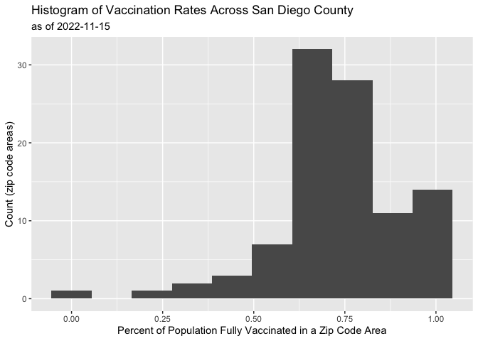
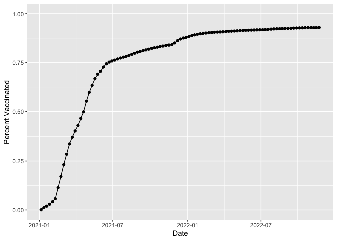
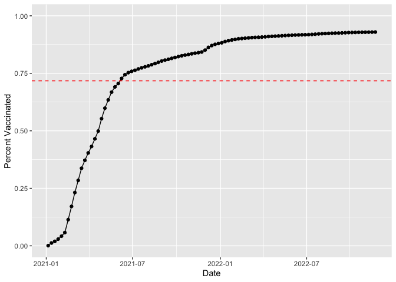
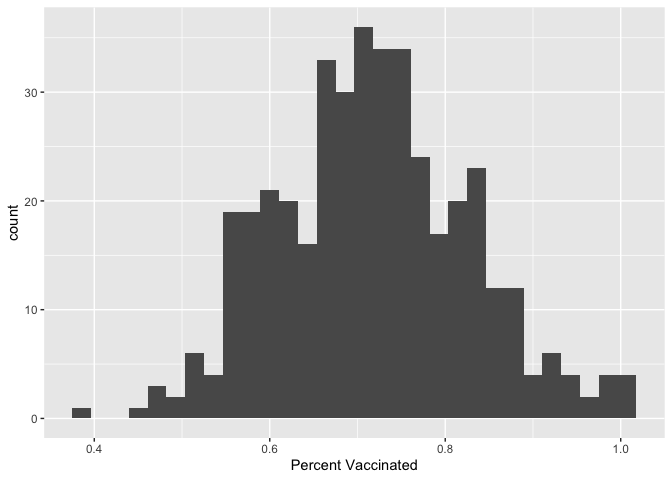
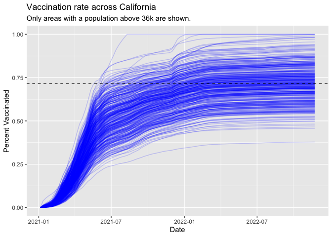

Class 17: Vaccination Rate Mini Project
================
Nicholas Yousefi

# Getting Started

First, we will import the data we downloaded.

``` r
vax <- read.csv("covid19vaccinesbyzipcode.csv")

head(vax)
```

      as_of_date zip_code_tabulation_area local_health_jurisdiction          county
    1 2021-01-05                    92240                 Riverside       Riverside
    2 2021-01-05                    91302               Los Angeles     Los Angeles
    3 2021-01-05                    93420           San Luis Obispo San Luis Obispo
    4 2021-01-05                    91901                 San Diego       San Diego
    5 2021-01-05                    94110             San Francisco   San Francisco
    6 2021-01-05                    91902                 San Diego       San Diego
      vaccine_equity_metric_quartile                 vem_source
    1                              1 Healthy Places Index Score
    2                              4 Healthy Places Index Score
    3                              3 Healthy Places Index Score
    4                              3 Healthy Places Index Score
    5                              4 Healthy Places Index Score
    6                              4 Healthy Places Index Score
      age12_plus_population age5_plus_population tot_population
    1               29270.5                33093          35278
    2               23163.9                25899          26712
    3               26694.9                29253          30740
    4               15549.8                16905          18162
    5               64350.7                68320          72380
    6               16620.7                18026          18896
      persons_fully_vaccinated persons_partially_vaccinated
    1                       NA                           NA
    2                       15                          614
    3                       NA                           NA
    4                       NA                           NA
    5                       17                         1268
    6                       15                          397
      percent_of_population_fully_vaccinated
    1                                     NA
    2                               0.000562
    3                                     NA
    4                                     NA
    5                               0.000235
    6                               0.000794
      percent_of_population_partially_vaccinated
    1                                         NA
    2                                   0.022986
    3                                         NA
    4                                         NA
    5                                   0.017519
    6                                   0.021010
      percent_of_population_with_1_plus_dose booster_recip_count
    1                                     NA                  NA
    2                               0.023548                  NA
    3                                     NA                  NA
    4                                     NA                  NA
    5                               0.017754                  NA
    6                               0.021804                  NA
      bivalent_dose_recip_count eligible_recipient_count
    1                        NA                        2
    2                        NA                       15
    3                        NA                        4
    4                        NA                        8
    5                        NA                       17
    6                        NA                       15
                                                                   redacted
    1 Information redacted in accordance with CA state privacy requirements
    2 Information redacted in accordance with CA state privacy requirements
    3 Information redacted in accordance with CA state privacy requirements
    4 Information redacted in accordance with CA state privacy requirements
    5 Information redacted in accordance with CA state privacy requirements
    6 Information redacted in accordance with CA state privacy requirements

> Q1. What column details the total number of people fully vaccinated?

`persons_fully_vaccinated`

> Q2. What column details the Zip code tabulation area?

`zip_code_tabulation_area`

> Q3. What is the earliest date in this dataset?

``` r
vax$as_of_date[1]
```

    [1] "2021-01-05"

> Q4. What is the latest date in this dataset?

``` r
vax$as_of_date[length(vax$as_of_date)]
```

    [1] "2022-11-22"

Note: the lab sheet says a different date is correct since the data was
updated after the lab sheet was created.

Let’s get a quick overview of the dataset by calling the `skim()`
function.

``` r
skimr::skim(vax)
```

|                                                  |        |
|:-------------------------------------------------|:-------|
| Name                                             | vax    |
| Number of rows                                   | 174636 |
| Number of columns                                | 18     |
| \_\_\_\_\_\_\_\_\_\_\_\_\_\_\_\_\_\_\_\_\_\_\_   |        |
| Column type frequency:                           |        |
| character                                        | 5      |
| numeric                                          | 13     |
| \_\_\_\_\_\_\_\_\_\_\_\_\_\_\_\_\_\_\_\_\_\_\_\_ |        |
| Group variables                                  | None   |

Data summary

**Variable type: character**

| skim_variable             | n_missing | complete_rate | min | max | empty | n_unique | whitespace |
|:--------------------------|----------:|--------------:|----:|----:|------:|---------:|-----------:|
| as_of_date                |         0 |             1 |  10 |  10 |     0 |       99 |          0 |
| local_health_jurisdiction |         0 |             1 |   0 |  15 |   495 |       62 |          0 |
| county                    |         0 |             1 |   0 |  15 |   495 |       59 |          0 |
| vem_source                |         0 |             1 |  15 |  26 |     0 |        3 |          0 |
| redacted                  |         0 |             1 |   2 |  69 |     0 |        2 |          0 |

**Variable type: numeric**

| skim_variable                              | n_missing | complete_rate |     mean |       sd |    p0 |      p25 |      p50 |      p75 |     p100 | hist  |
|:-------------------------------------------|----------:|--------------:|---------:|---------:|------:|---------:|---------:|---------:|---------:|:------|
| zip_code_tabulation_area                   |         0 |          1.00 | 93665.11 |  1817.39 | 90001 | 92257.75 | 93658.50 | 95380.50 |  97635.0 | ▃▅▅▇▁ |
| vaccine_equity_metric_quartile             |      8613 |          0.95 |     2.44 |     1.11 |     1 |     1.00 |     2.00 |     3.00 |      4.0 | ▇▇▁▇▇ |
| age12_plus_population                      |         0 |          1.00 | 18895.04 | 18993.88 |     0 |  1346.95 | 13685.10 | 31756.12 |  88556.7 | ▇▃▂▁▁ |
| age5_plus_population                       |         0 |          1.00 | 20875.24 | 21105.98 |     0 |  1460.50 | 15364.00 | 34877.00 | 101902.0 | ▇▃▂▁▁ |
| tot_population                             |      8514 |          0.95 | 23372.77 | 22628.51 |    12 |  2126.00 | 18714.00 | 38168.00 | 111165.0 | ▇▅▂▁▁ |
| persons_fully_vaccinated                   |     14921 |          0.91 | 13466.34 | 14722.46 |    11 |   883.00 |  8024.00 | 22529.00 |  87186.0 | ▇▃▁▁▁ |
| persons_partially_vaccinated               |     14921 |          0.91 |  1707.50 |  1998.80 |    11 |   167.00 |  1194.00 |  2547.00 |  39204.0 | ▇▁▁▁▁ |
| percent_of_population_fully_vaccinated     |     18665 |          0.89 |     0.55 |     0.25 |     0 |     0.39 |     0.59 |     0.73 |      1.0 | ▃▃▆▇▃ |
| percent_of_population_partially_vaccinated |     18665 |          0.89 |     0.08 |     0.09 |     0 |     0.05 |     0.06 |     0.08 |      1.0 | ▇▁▁▁▁ |
| percent_of_population_with_1\_plus_dose    |     19562 |          0.89 |     0.61 |     0.25 |     0 |     0.46 |     0.65 |     0.79 |      1.0 | ▂▂▆▇▆ |
| booster_recip_count                        |     70421 |          0.60 |  5655.17 |  6867.49 |    11 |   280.00 |  2575.00 |  9421.00 |  58304.0 | ▇▂▁▁▁ |
| bivalent_dose_recip_count                  |    156958 |          0.10 |  1646.02 |  2161.84 |    11 |   109.00 |   719.00 |  2443.00 |  18109.0 | ▇▁▁▁▁ |
| eligible_recipient_count                   |         0 |          1.00 | 12309.19 | 14555.83 |     0 |   466.00 |  5810.00 | 21140.00 |  86696.0 | ▇▂▁▁▁ |

> Q5. How many numeric columns are in this dataset?

13

> Q6. Note that there are “missing values” in the dataset. How many NA
> values there in the persons_fully_vaccinated column?

``` r
sum(is.na(vax$persons_fully_vaccinated))
```

    [1] 14921

> Q7. What percent of persons_fully_vaccinated values are missing (to 2
> significant figures)?

``` r
round(sum(is.na(vax$persons_fully_vaccinated)) / length(vax$persons_fully_vaccinated) * 100, 2)
```

    [1] 8.54

> Q8. \[Optional\]: Why might this data be missing?

Some counties do not report vaccination rates (e.g. due to privacy
laws).

# Working with dates

Dates can be annoying to work with. But the package, `lubridate` makes
it easier!

``` r
library(lubridate)
```

    Loading required package: timechange


    Attaching package: 'lubridate'

    The following objects are masked from 'package:base':

        date, intersect, setdiff, union

``` r
# today's date (as of the time I submitted this)
today()
```

    [1] "2022-12-05"

Let’s convert our `as_of_date` column to dates from strings, so that we
can do math easily on them.

``` r
vax$as_of_date <- ymd(vax$as_of_date)
```

Now, we can do math with these dates. Let’s see how long ago the first
vaccination reported in this dataset occurred:

``` r
today() - vax$as_of_date[1]
```

    Time difference of 699 days

Let’s see how many days the dataset spans.

``` r
vax$as_of_date[nrow(vax)] - vax$as_of_date[1]
```

    Time difference of 686 days

> Q9. How many days have passed since the last update of the dataset?

``` r
today() - vax$as_of_date[nrow(vax)]
```

    Time difference of 13 days

> Q10. How many unique dates are in the dataset (i.e. how many different
> dates are detailed)?

``` r
length(unique(vax$as_of_date))
```

    [1] 99

# Working with ZIP codes

This dataset contains zip codes. To make working with zip codes easier,
we use the `zipcodeR` package.

``` r
library(zipcodeR)
```

Let’s find the centroid of the La Jolla 92037 (i.e. UC San Diego) ZIP
code area.

``` r
geocode_zip('92037')
```

    # A tibble: 1 × 3
      zipcode   lat   lng
      <chr>   <dbl> <dbl>
    1 92037    32.8 -117.

Now, let’s calculate the distance between the centroids of UCSD’s zip
code and my home zip code in miles.

``` r
zip_distance('92037','93012')
```

      zipcode_a zipcode_b distance
    1     92037     93012   141.81

We can also give a zip code and get census data about that zip code:

``` r
reverse_zipcode(c('92037', "92109"))
```

    # A tibble: 2 × 24
      zipcode zipcode_…¹ major…² post_…³ common_c…⁴ county state   lat   lng timez…⁵
      <chr>   <chr>      <chr>   <chr>       <blob> <chr>  <chr> <dbl> <dbl> <chr>  
    1 92037   Standard   La Jol… La Jol… <raw 20 B> San D… CA     32.8 -117. Pacific
    2 92109   Standard   San Di… San Di… <raw 21 B> San D… CA     32.8 -117. Pacific
    # … with 14 more variables: radius_in_miles <dbl>, area_code_list <blob>,
    #   population <int>, population_density <dbl>, land_area_in_sqmi <dbl>,
    #   water_area_in_sqmi <dbl>, housing_units <int>,
    #   occupied_housing_units <int>, median_home_value <int>,
    #   median_household_income <int>, bounds_west <dbl>, bounds_east <dbl>,
    #   bounds_north <dbl>, bounds_south <dbl>, and abbreviated variable names
    #   ¹​zipcode_type, ²​major_city, ³​post_office_city, ⁴​common_city_list, …

# Focus on the San Diego area

Let’s just focus on the San Diego area. We will filter the data so that
we only have data for `vax$county == "San Diego"`.

``` r
sd <- vax[vax$county == "San Diego",]

nrow(sd)
```

    [1] 10593

It would be more convenient to use `dplyr` if we were trying to filter
accross multiple criteria (e.g. all of San Diego County with a
population greater than 10,000).

``` r
library(dplyr)
```


    Attaching package: 'dplyr'

    The following objects are masked from 'package:stats':

        filter, lag

    The following objects are masked from 'package:base':

        intersect, setdiff, setequal, union

``` r
sd.10 <- filter(vax, county == "San Diego" & age5_plus_population > 10000)
```

> Q11. How many distinct zip codes are listed for San Diego County?

``` r
length(unique(sd$zip_code_tabulation_area))
```

    [1] 107

> Q12. What San Diego County Zip code area has the largest 12 +
> Population in this dataset?

``` r
sd$zip_code_tabulation_area[which.max(sd$age12_plus_population)]
```

    [1] 92154

Let’s use `deplyr` to select all San Diego “county” areas on
“as_of_date” “2022-11-15”.

``` r
sd_county_11_15 <- sd %>% filter(as_of_date == "2022-11-15")
```

> Q13. What is the overall average “Percent of Population Fully
> Vaccinated” value for all San Diego “County” as of “2022-11-15”?

``` r
mean(sd_county_11_15$percent_of_population_fully_vaccinated, na.rm=T)
```

    [1] 0.7369099

> Q14. Using either ggplot or base R graphics make a summary figure that
> shows the distribution of Percent of Population Fully Vaccinated
> values as of “2022-11-15”?

``` r
library(ggplot2)

ggplot(sd_county_11_15) + aes(percent_of_population_fully_vaccinated) + geom_histogram(bins=10) + labs(title="Histogram of Vaccination Rates Across San Diego County", subtitle="as of 2022-11-15", x="Percent of Population Fully Vaccinated in a Zip Code Area", y="Count (zip code areas)")
```

    Warning: Removed 8 rows containing non-finite values (stat_bin).



# Focus on UCSD/La Jolla

``` r
ucsd <- filter(sd, zip_code_tabulation_area=="92037")
ucsd[1,]$age5_plus_population
```

    [1] 36144

> Q15. Using ggplot make a graph of the vaccination rate time course for
> the 92037 ZIP code area:

``` r
ucsd_plot <- ggplot(ucsd) +
  aes(as_of_date,
      percent_of_population_fully_vaccinated) +
  geom_point() +
  geom_line(group=1) +
  ylim(c(0,1)) +
  labs(x="Date", y="Percent Vaccinated")
ucsd_plot
```



# Comparing to similar sized areas

It looks like the trend in the previous graph started off slow (when
vaccines were not widely available), then shot up, then slowed down
again as many people got vaccinated. Let’s see if this trend is similar
to trends in other areas. Let’s filter the data for zip codes with a
population at least as large as that of 92037 on
`as_of_date=="2022-11-15"`

``` r
# Subset to all CA areas with a population as large as 92037
vax.36 <- filter(vax, age5_plus_population > 36144 &
                as_of_date == "2022-11-15")

head(vax.36)
```

      as_of_date zip_code_tabulation_area local_health_jurisdiction        county
    1 2022-11-15                    92236                 Riverside     Riverside
    2 2022-11-15                    92130                 San Diego     San Diego
    3 2022-11-15                    94121             San Francisco San Francisco
    4 2022-11-15                    94551                   Alameda       Alameda
    5 2022-11-15                    94112             San Francisco San Francisco
    6 2022-11-15                    94303               Santa Clara   Santa Clara
      vaccine_equity_metric_quartile                 vem_source
    1                              1 Healthy Places Index Score
    2                              4 Healthy Places Index Score
    3                              4 Healthy Places Index Score
    4                              4 Healthy Places Index Score
    5                              3 Healthy Places Index Score
    6                              3 Healthy Places Index Score
      age12_plus_population age5_plus_population tot_population
    1               38505.3                42923          45477
    2               46300.3                53102          56134
    3               39105.0                41363          43616
    4               38947.9                43399          47227
    5               75681.8                81107          84707
    6               40033.3                44989          48244
      persons_fully_vaccinated persons_partially_vaccinated
    1                    30465                         3858
    2                    52380                         5751
    3                    36566                         2373
    4                    32557                         2333
    5                    78358                         4646
    6                    41275                         4175
      percent_of_population_fully_vaccinated
    1                               0.669899
    2                               0.933124
    3                               0.838362
    4                               0.689373
    5                               0.925048
    6                               0.855547
      percent_of_population_partially_vaccinated
    1                                   0.084834
    2                                   0.102451
    3                                   0.054407
    4                                   0.049400
    5                                   0.054848
    6                                   0.086539
      percent_of_population_with_1_plus_dose booster_recip_count
    1                               0.754733               12943
    2                               1.000000               34821
    3                               0.892769               28345
    4                               0.738773               20223
    5                               0.979896               56744
    6                               0.942086               26288
      bivalent_dose_recip_count eligible_recipient_count redacted
    1                      1395                    30375       No
    2                     11203                    51780       No
    3                     10994                    36013       No
    4                      5568                    32234       No
    5                     16019                    77580       No
    6                      8573                    40853       No

> Q16. Calculate the mean “Percent of Population Fully Vaccinated” for
> ZIP code areas with a population as large as 92037 (La Jolla)
> as_of_date “2022-11-15”. Add this as a straight horizontal line to
> your plot from above with the geom_hline() function?

``` r
avg_pct_vaccinated <- mean(vax.36$percent_of_population_fully_vaccinated)
avg_pct_vaccinated
```

    [1] 0.7172851

``` r
ucsd_plot + geom_hline(yintercept=avg_pct_vaccinated, col="red", linetype=2)
```



> Q17. What is the 6 number summary (Min, 1st Qu., Median, Mean, 3rd
> Qu., and Max) of the “Percent of Population Fully Vaccinated” values
> for ZIP code areas with a population as large as 92037 (La Jolla)
> as_of_date “2022-11-15”?

``` r
fivenum(vax.36$percent_of_population_fully_vaccinated)
```

    [1] 0.3785010 0.6396185 0.7155240 0.7879820 1.0000000

``` r
mean(vax.36$percent_of_population_fully_vaccinated)
```

    [1] 0.7172851

> Q18. Using ggplot generate a histogram of this data.

``` r
ggplot(vax.36) + aes(percent_of_population_fully_vaccinated) + geom_histogram() + labs(x="Percent Vaccinated")
```

    `stat_bin()` using `bins = 30`. Pick better value with `binwidth`.



> Q19. Is the 92109 and 92040 ZIP code areas above or below the average
> value you calculated for all these above?

``` r
per_vax_92040 <- vax %>% filter(as_of_date == "2022-11-15") %>%  
  filter(zip_code_tabulation_area=="92040") %>%
  select(percent_of_population_fully_vaccinated)
if (per_vax_92040 > avg_pct_vaccinated) {
  print("The 92040 zip code area is above the average value for ZIP code areas with a population as large as 92037 (La Jolla) as_of_date “2022-11-15")
} else {
  print("The 92040 zip code area is below the average value for ZIP code areas with a population as large as 92037 (La Jolla) as_of_date “2022-11-15")
}
```

    [1] "The 92040 zip code area is below the average value for ZIP code areas with a population as large as 92037 (La Jolla) as_of_date “2022-11-15"

``` r
per_vax_92040 <- vax %>% filter(as_of_date == "2022-11-15") %>%  
  filter(zip_code_tabulation_area=="92109") %>%
  select(percent_of_population_fully_vaccinated)
if (per_vax_92040 > avg_pct_vaccinated) {
  print("The 92109 zip code area is above the average value for ZIP code areas with a population as large as 92037 (La Jolla) as_of_date “2022-11-15")
} else {
  print("The 92109 zip code area is below the average value for ZIP code areas with a population as large as 92037 (La Jolla) as_of_date “2022-11-15")
}
```

    [1] "The 92109 zip code area is below the average value for ZIP code areas with a population as large as 92037 (La Jolla) as_of_date “2022-11-15"

> Q20. Finally make a time course plot of vaccination progress for all
> areas in the full dataset with a age5_plus_population \> 36144.

``` r
vax.36.all <- filter(vax, age5_plus_population > 36144)


ggplot(vax.36.all) +
  aes(as_of_date,
      percent_of_population_fully_vaccinated, 
      group=zip_code_tabulation_area) +
  geom_line(alpha=0.2, color="blue") +
  ylim(0, 1) +
  labs(x="Date", y="Percent Vaccinated",
       title="Vaccination rate across California",
       subtitle="Only areas with a population above 36k are shown.") +
  geom_hline(yintercept = avg_pct_vaccinated, linetype=2)
```

    Warning: Removed 184 row(s) containing missing values (geom_path).



> Q21. How do you feel about traveling for Thanksgiving Break and
> meeting for in-person class afterwards?

It will be fine with me to meet for an in-person class after travelling
for Thanksgiving.
